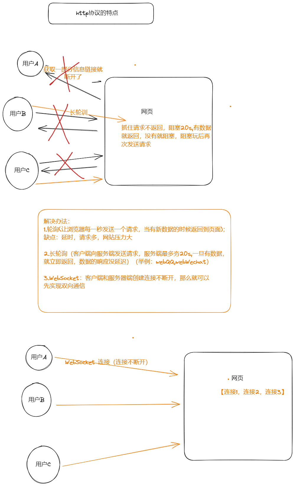

# 1.WebSocket相关
+ 1.举例：一个系统:20个用户同时打开网站，呈现出来的就是群聊
	+ 我
	+ 喜羊羊
	+ 美羊羊
	+ 阿困
	+ 阿西
	+ ...
+ 就是别人发送信息本地实时接收并显示（即实时刷新--主动刷新）

+ 2.web与http
+ 



### 1.1轮询
+ 访问/home/显示的聊天室界面（简陋版）
+ 视图层(views.py)
```python
def home(request):  
    return render(request,"home.html")  
    pass
```


+ 点击发送内容，数据也可以发送到后台
	+ 点击发送后会显示发送的文本文件，同时控制台会显示发送成功
+ 视图层(views.py)
```python
def sendmsg(request):  
    #将获取的信息以text变量暂时接收  
    text=request.GET.get("text")  
    DB.append(text)  
    # print("接收到用户端的请求：",request.GET.get("text"))  
    return  HttpResponse("ok")
```
+ HTML中Scripts
```javascript
function sentMessage(){  
    {#用户输入的数据#}  
    var text = $("#txt").val();  
  
    //基于Ajax将用户输入的文本信息发送到后台（偷偷的发送请求）。  
    $.ajax({  
        url:'/send/msg/',  
        type:'GET',  
        data:{  
            text:text  
        },  
        success:function (res){  
            console.log("请求发送成功",res);  
        }  
    })  
}
```


+ 定时获取消息(通过最大的索引来判断是否有新数据的传递)，界面演示
+ 视图层（Views.py）
```python
def getmsg(request):  
    index=request.GET.get("index")#接收到的数据为字符串类型  
    print(index)  
    index=int(index)  
    #构造成了一个字典  
    context={  
        "data":DB[index:],  
        "max_index":len(DB)  
    }  
    return JsonResponse(context)#数据进行序列化;还会加上:响应头 application/json
```
+ HTML中Scripts
```javascript
var  max_index=0;  
//每隔2s向后台发送请求获取数据并展示到页面上  
setInterval(function (){//定时的作用  
    //发送请求获取数据  
    $.ajax({  
        url:'/get/msg/',  
        type: "GET",  
        data: {  
            index:max_index  
        },  
        dataType:"JSON",//内部自动转换  
        success:function (dataDict) {  
        console.log("获取到的数据-->",dataDict);  
        {#var dataDict = JSON.parse(res);#}  
        max_index=dataDict.max_index;  
        $.each(dataDict.data,function (index,item)  
            {  
                console.log(index,item);  
                //将内容拼接成div标签，并前加到message区域  
                var tag = $("<div>");  
                tag.text(item)//类似<div>item</div>  
                $("#message").append(tag)  
            }  
        )  
  
        }  
    })  
},10*1000)//后面代表时间
```

+ 缺点：请求次数多，服务器压力大，同时具有延迟
#### 1.1.1总代码
+ 路由层（url.py）
+ 注：需要提前设置好环境
```python
from django.contrib import admin  
from django.urls import path  
from app01 import views  
urlpatterns = [  
    path("admin/", admin.site.urls),  
    path("home/", views.home),  
    path("send/msg/", views.sendmsg),  
    path("get/msg/", views.getmsg),  
]
```

+ 视图层(views.py)
```python
import json  
from django.shortcuts import render,HttpResponse  
from django.http import JsonResponse  
# Create your views here.  
#将用户发送的数据存储起来，一旦有新消息到来，我就放在数据库中  
DB=[]  
def home(request):  
    return render(request,"home.html")  
    pass  
  
def sendmsg(request):  
    #将获取的信息以text变量暂时接收  
    text=request.GET.get("text")  
    DB.append(text)  
    # print("接收到用户端的请求：",request.GET.get("text"))  
    return  HttpResponse("ok")  
  
def getmsg(request):  
    index=request.GET.get("index")#接收到的数据为字符串类型  
    print(index)  
    index=int(index)  
    #构造成了一个字典  
    context={  
        "data":DB[index:],  
        "max_index":len(DB)  
    }  
    return JsonResponse(context)#数据进行序列化;还会加上:响应头 application/json
```
+ 网页(templates)( home.html)

```html
<!DOCTYPE html>  
<html lang="en">  
<head>  
    <meta charset="UTF-8">  
    <title>Title</title>  
    <style>  
        .message{  
            height: 300px;  
            border:1px solid red;  
            width: 100%;  
        }  
    </style>  
</head>  
<body>  
    <div class="message" id="message"></div>  
    <div>  
        <input type="text" placeholder="请输入" id="txt">  
        <input type="button" value="发送" onclick="sentMessage();">  
    </div>  
  
<script src="https://cdn.bootcdn.net/ajax/libs/jquery/3.6.3/jquery.min.js"></script>  
<script>  
    function sentMessage(){  
        {#用户输入的数据#}  
        var text = $("#txt").val();  
  
        //基于Ajax将用户输入的文本信息发送到后台（偷偷的发送请求）。  
        $.ajax({  
            url:'/send/msg/',  
            type:'GET',  
            data:{  
                text:text  
            },  
            success:function (res){  
                console.log("请求发送成功",res);  
            }  
        })  
    }  
  
    var  max_index=0;  
    //每隔2s向后台发送请求获取数据并展示到页面上  
    setInterval(function (){//定时的作用  
        //发送请求获取数据  
        $.ajax({  
            url:'/get/msg/',  
            type: "GET",  
            data: {  
                index:max_index  
            },  
            dataType:"JSON",//内部自动转换  
            success:function (dataDict) {  
            console.log("获取到的数据-->",dataDict);  
            {#var dataDict = JSON.parse(res);#}  
            max_index=dataDict.max_index;  
            $.each(dataDict.data,function (index,item)  
                {  
                    console.log(index,item);  
                    //将内容拼接成div标签，并前加到message区域  
                    var tag = $("<div>");  
                    tag.text(item)//类似<div>item</div>  
                    $("#message").append(tag)  
                }  
            )  
  
            }  
        })  
    },10*1000)  
</script>  
</body>  
</html>
```


### 1.2长轮询

+ 访问/home/显示的聊天室界面；每个用户创建一个队列（再轮询层面进行修改）
```python
USER_QUEUR={}  
def home(request):  
    uid=request.GET.get('uid')  
    USER_QUEUR[uid]=queue.Queue()  
    return render(request,"home.html",{"uid":uid})  
    pass
```

+ 点击发送内容，数据也可以发送到后台(扔到每个人队列中)
```javascript
function sentMessage(){  
    {#用户输入的数据#}  
    var text = $("#txt").val();  
  
    //基于Ajax将用户输入的文本信息发送到后台（偷偷的发送请求）。  
    $.ajax({  
        url:'/send/msg/',  
        type:'GET',  
        data:{  
            text:text  
        },  
        success:function (res){  
            console.log("请求发送成功",res);  
        }  
    })  
}
```

```python
def sendmsg(request):  
    text=request.GET.get('text')  
    for uid,q in USER_QUEUR.items():  
        q.put(text)  
    return  HttpResponse('OK')
```


+ 递归获取消息，去自己的队列数据，然后再界面上展示
```python
def getmsg(request):  
    #各自去各自队列获取数九，需要明白自己的uid  
    uid=request.GET.get('uid')  
    q=USER_QUEUR[uid]#根据自己的uid，获取自己的队列  
    result={'status':True,'data':None}  
    try:  
        data=q.get(timeout=10)  
        result["data"]=data  
    except queue.Empty as e:  
        result["status"] = False  
    print(result)  
    return JsonResponse(result)
```
```javascript
function getMessage() {  
    $.ajax({  
        url:'/get/msg/',  
        type:'GET',  
        data:{  
            uid:USER_UID,  
        },  
  
        dataType:"JSON",  
        success:function (res) {  
            //超时，没有新数据  
            // 有新数据，展示信息数据  
           if(res.status){  
                var tag=$("<div>");  
                tag.text(res.data)  
               $("#message").append(tag)  
           }  
            getMessage();//JS中的这种模式，看似递归，但内部却不是递归  
        }  
    })  
}  
//当页面框架加载完毕后执行  
$(function () {  
    getMessage();  
  
})
```
#### 1.2.1总代码
+ 总代码（python）view层

```python
import  queue  
from django.shortcuts import render,HttpResponse  
from django.http import JsonResponse  
# Create your views here.  
  
USER_QUEUR={  
}  
def home(request):  
    uid=request.GET.get('uid')  
    USER_QUEUR[uid]=queue.Queue()  
    return render(request,"home.html",{"uid":uid})  
    pass  
  
def sendmsg(request):  
    text=request.GET.get('text')  
    for uid,q in USER_QUEUR.items():  
        q.put(text)  
    return  HttpResponse('OK')  
def getmsg(request):  
    #各自去各自队列获取数九，需要明白自己的uid  
    uid=request.GET.get('uid')  
    q=USER_QUEUR[uid]#根据自己的uid，获取自己的队列  
    result={'status':True,'data':None}  
    try:  
        data=q.get(timeout=10)  
        result["data"]=data  
    except queue.Empty as e:  
        result["status"] = False  
    print(result)  
    return JsonResponse(result)
```

+ 网页层

```html
<!DOCTYPE html>  
<html lang="en">  
<head>  
    <meta charset="UTF-8">  
    <title>Title</title>  
    <style>  
        .message{  
            height: 300px;  
            border:1px solid red;  
            width: 100%;  
        }  
    </style>  
</head>  
<body>  
    <div class="message" id="message"></div>  
    <div>  
        <input type="text" placeholder="请输入" id="txt">  
        <input type="button" value="发送" onclick="sentMessage();">  
    </div>  
  
<script src="https://cdn.bootcdn.net/ajax/libs/jquery/3.6.3/jquery.min.js"></script>  
<script>  
    USER_UID="{{ uid }}"  
    function sentMessage(){  
        {#用户输入的数据#}  
        var text = $("#txt").val();  
  
        //基于Ajax将用户输入的文本信息发送到后台（偷偷的发送请求）。  
        $.ajax({  
            url:'/send/msg/',  
            type:'GET',  
            data:{  
                text:text  
            },  
            success:function (res){  
                console.log("请求发送成功",res);  
            }  
        })  
    }  
  
    function getMessage() {  
        $.ajax({  
            url:'/get/msg/',  
            type:'GET',  
            data:{  
                uid:USER_UID,  
            },  
  
            dataType:"JSON",  
            success:function (res) {  
                //超时，没有新数据  
                // 有新数据，展示信息数据  
               if(res.status){  
                    var tag=$("<div>");  
                    tag.text(res.data)  
                   $("#message").append(tag)  
               }  
                getMessage();//JS中的这种模式，看似递归，但内部却不是递归  
            }  
        })  
    }  
    //当页面框架加载完毕后执行  
    $(function () {  
        getMessage();  
  
    })  
  
  
</script>  
</body>  
</html>
```

### 1.3WebSocket
websocket,web中的socket
1. 原先的web中：
+ http协议，无状态&短连接
	+ 客户端主动连接服务器
	+ 客户端向服务端发送消息，服务端接收到返回数据
	+ 客户端接收到数据
	+ 断开连接
+ https一些+对数据进行加密
	+ 在开发的过程中，需要保留一些状态信息，可以基于Cookie来做
2. 目前支持
+ http协议：一次请求，一次响应
+ websocket协议，创建连持久的连接不断开，基于这个连接可以进行收发数据。【服务端向客户端主动发送信息】
	+ Web聊天室
	+ 实时信息，图标，柱状图，饼图（Echarts）

#### 1.3.1WebSocket 原理（P8未看）
1. http协议
	1. 连接
	2. 数据传输
	3. 断开连接
2. WebSocket协议，是建立在http协议之上的.
	1. 连接：客户端发起连接
	2. 握手（验证）：客户端发送一个消息，后端接收到消息再做一些特殊处理并返回。当数据处理正确时，此时说明服务端支持websocket协议
		1. 客户端向服务端发送数据(p7,8,9,10)
		```
		
		```
		 2.  服务端接收
	```
	
	```

	```
	
	```


	3. 收发数据（加密）
	```python
b="ahdjgfdalcfbaslpfdu1qw3dbq;edughqwdhAKEDHJKLSE"#随机生成

	```

	4. 断开连接.

####  1.3.2django框架
+ django默认不支持websocket框架，需要安装插件
```
pip install channels==3.0.5(建议指定channels的版本为3.x**)
```
##### 环境配置
1. 注册APP
```python
INSTALLED_APPS = [  
    "django.contrib.admin",  
    "django.contrib.auth",  
    "django.contrib.contenttypes",  
    "django.contrib.sessions",  
    "django.contrib.messages",  
    "django.contrib.staticfiles",  
    "app01.apps.App01Config",  
    'channels',  
]
```
2.  在settings.py中添加asgi_application3

```python
ASGI_APPLICATION="WebSocket.asgi.application"
#WebSocket:文件名
  
CHANNEL_LAYERS={  
    "default": {  
        "BACKEND":"channels.layers.InMemoryChannelLayer"  
    }  
}
```
3. 修改asgi.py
```python
import os  
  
from django.core.asgi import get_asgi_application  
from channels.routing import ProtocolTypeRouter,URLRouter  
import rounting  
os.environ.setdefault("DJANGO_SETTINGS_MODULE", "WebSocket.settings")  
  
# application = get_asgi_application()  
application=ProtocolTypeRouter({  
    "http": get_asgi_application(),#自动找urls.py,找视图函数 --.http    "websocket":URLRouter(rountings.websocket_urlpatterns),#rountings(相当于urls),consumers(相当于views)  
})
```
4. 在settings.py的同级目录创建rounting.py

```python
from django.urls import re_path  
  
from app01 import consumers  
websocket_urlpatterns=[  
    re_path(r'ws/(?P<group>\w+)/$',consumers.ChatConsumer.as_asgi()),  
]
```
5. 在app01目录下创建consumer.py，编写处理好websocket的业务逻辑

```python
from channels.generic.websocket import WebsocketConsumer  
from channels.exceptions import  StopConsumer  
  
class ChatConsumer(WebsocketConsumer):  
    def websocket_connect(self, message):  
        #有客户端向后端发送websocket连接请求时，自动触发  
        #服务端允许客户端创建连接  
        self.accept()  
        pass  
    def websocket_receive(self, message):  
        #浏览器基于websocket向后端发送数据，自动触发接收信息  
        print(message)  
        self.send("不要回复")  
        pass  
    def websocket_disconnect(self, message):  
        #客户端与服务端断开连接时，自动触发 
		print("断开连接")
        raise StopConsumer
```


##### django之wsgi与asgi
+ wsgi:用户接收用户的请求，再将请求传递给django,然后再由django处理业务请求，一般只支持同步

+ asgi:wsgi+异步+websocket.

+ http
```
urls.py
views.py
```

+ wevvsocket
```
rounting.py
consumers.py
```


#### 1.3.3聊天室（个人聊天）
+ 访问地址，看见聊天室页面--》http请求
+ 让客户端主动向服务器端发起webscoket连接，服务器接收到连接后通过（握手）
	+ 客户端，websocket
		```python
			socket=new WebSocket("ws://127.0.0.1:8000/room/123/");
		```

	+ 服务端
		```python
		from channels.generic.websocket import WebsocketConsumer  
		from channels.exceptions import  StopConsumer  
		  
		class ChatConsumer(WebsocketConsumer):  
			def websocket_connect(self, message):  
				print("有人来连接了")  
				#有客户端向后端发送websocket连接请求时，自动触发  
				#服务端允许客户端创建连接（握手。）  
				self.accept()
		```
		
	+ 收发消息（客户端向服务端发消息）
		+ 客户端
		```html
			<div class="message" id="message"></div>  
			<div>  
			    <input type="text" placeholder="请输入" id="txt">  
			    <input type="button" value="发送" onclick="sendMessage();">  
			</div>
		```

		+ 服务端
			```python
			from channels.generic.websocket import WebsocketConsumer  
			from channels.exceptions import  StopConsumer  
			class ChatConsumer(WebsocketConsumer):  
			    def websocket_connect(self, message):  
			        print("有人来连接了")  
			        #有客户端向后端发送websocket连接请求时，自动触发  
			        #服务端允许客户端创建连接（握手。）  
			        self.accept()  
			        pass  
			    def websocket_receive(self, message):  
			        #浏览器基于websocket向后端发送数据，自动触发接收信息  
			        # {'type': 'websocket.receive', 'text': '阿里嘎多'}  
			        text=message['texe']  
			        print("接收到的消息--->",text)  
			```
	+ 收发消息（服务端主动向客户端发送消息）
		+ 服务端
			```python
			from channels.generic.websocket import WebsocketConsumer  
			from channels.exceptions import  StopConsumer  
			  
			class ChatConsumer(WebsocketConsumer):  
			    def websocket_connect(self, message):  
			        print("有人来连接了")  
			        #有客户端向后端发送websocket连接请求时，自动触发  
			        #服务端允许客户端创建连接（握手。）  
			        self.accept()  
			  
			        #给客户端发送消息  
			        self.send("来了鸭巴嘎猫")
			```

			+ 
		+ 客户端
			```javascript
			//当websocketk接收到服务端发来的消息时，自动触发这个给函数  
			socket.onmessage=function (event) {  
			    console.log(event.data);  
			}
			```
			

##### 总代码
+ 前端
```html
<!DOCTYPE html>  
<html lang="en">  
<head>  
    <meta charset="UTF-8">  
    <title>Title</title>  
    <style>  
        .message{  
            height: 300px;  
            border:1px solid red;  
            width: 100%;  
        }  
    </style>  
</head>  
<body>  
    <div class="message" id="message"></div>  
    <div>  
        <input type="text" placeholder="请输入" id="txt">  
        <input type="button" value="发送" onclick="sendMessage();">  
        <input type="button" value="关闭连接" onclick="closeConn();">  
    </div>  
  
{#<script src="https://cdn.bootcdn.net/ajax/libs/jquery/3.6.3/jquery.min.js"></script>#}  
<script>  
    socket=new WebSocket("ws://127.0.0.1:8000/room/123/");  
  
    //创建好连接之后自动触发(服务器端执行self.accept())  
    socket.onopen=function (event) {  
        let tag = document.createElement("div");  
        tag.innerText="[连接成功]";  
        document.getElementById("message").appendChild(tag)  
  
    }  
    //当websocketk接收到服务端发来的消息时，自动触发这个给函数  
    socket.onmessage=function (event) {  
        let tag = document.createElement("div");  
        tag.innerText=event.data  
        document.getElementById("message").appendChild(tag)  
    }  
    socket.onclose=function (event) {  
        let tag = document.createElement("div");  
        tag.innerText="[断开连接]";  
        document.getElementById("message").appendChild(tag)  
    }  
    function sendMessage() {  
        var tag=document.getElementById("txt");  
        socket.send(tag.value);  
    }  
    //关闭连接  
    function closeConn() {  
        let tag = document.createElement("div");  
        tag.innerText="[断开连接]";  
        document.getElementById("message").appendChild(tag)  
        socket.close();//向服务端发送断开连接的请求  
    }  
</script>  
</body>  
</html>
```

+ 后端

```python  
from channels.generic.websocket import WebsocketConsumer  
from channels.exceptions import  StopConsumer  
  
class ChatConsumer(WebsocketConsumer):  
    def websocket_connect(self, message):  
        print("有人来连接了")  
        #有客户端向后端发送websocket连接请求时，自动触发  
        #服务端允许客户端创建连接（握手。）  
        self.accept()  
  
        #给客户端发送消息  
        self.send("来了鸭巴嘎猫")  
        pass  
    def websocket_receive(self, message):  
        #浏览器基于websocket向后端发送数据，自动触发接收信息  
        # {'type': 'websocket.receive', 'text': '阿里嘎多'}  
        text=message['text']  
        print("接收到的消息--->",text)  
        if text=="关闭":  
            #服务端关闭连接,给客服端发送一条断开连接的消息  
            self.close()  
            raise StopConsumer()#如果服务器断开连接，执行StopConsumer异常，那么websocket_disconnect方法不在执行  
            return  
  
        result="{}SB".format(text)  
        self.send(result)  
        pass  
    def websocket_disconnect(self, message):  
        #客户端与服务端断开连接时，自动触发  
        print("断开连接")  
        raise StopConsumer
```


#### 1.3.4群聊
> 基于channels中提供的channel layer实现
+ seeting中的配置
```python
CHANNEL_LAYERS={  
    "default": {  
        "BACKEND":"channels.layers.InMemoryChannelLayer"  
    }  
}
```
> 基于redis中提供的channel layer实现
```python
pip install channel-redis
然后再进行配置
CHANNEL_LAYERS={  
    "default": {  
        "BACKEND":"channels_redis.layers.InMemoryChannelLayer"  
	    "CONFIG":{
	    "hosts":{{'主机号'，6379（端口）}}
	    }
    }  
}
```

+ consumers中的特殊代码
```python
from channels.generic.websocket import WebsocketConsumer  
from channels.exceptions import  StopConsumer  
from asgiref.sync import  async_to_sync  
  
class ChatConsumer(WebsocketConsumer):  
    def websocket_connect(self, message):  
        print("有人来连接了")  
        #有客户端向后端发送websocket连接请求时，自动触发  
        #服务端允许客户端创建连接（握手。）  
        self.accept()  
        #获取群号，获取路由匹配中的群号  
        group=self.scope['url_route']['kwargs'].get('group')  
        #将客户端的连接对象加入到某个地方（内存 或者 redis）===>async_to_sync：将异步的功能转换为同步的功能  
        async_to_sync(self.channel_layer.group_add) (group,self.channel_name)  
  
  
        pass  
    def websocket_receive(self, message):  
        group=self.scope['url_route']['kwargs'].get('group')  
  
        #通知组内的所有客户端、执行xx_oo方法，在此方法中自己可以去定义任意的功能  
        async_to_sync(self.channel_layer.group_send)(group,{"type":"xx.oo",'message':message})  
        pass  
    def xx_oo(self,event):  
        text=event['message']['text']  
        self.send(text)  
    def websocket_disconnect(self, message):  
        group=self.scope['url_route']['kwargs'].get('group')  
        #客户端与服务端断开连接时，自动触发  
        async_to_sync(self.channel_layer.group_discard)(group,self.channel_name)  
        print("断开连接")  
        raise StopConsumer

```

### 总结
1. webSocket是一种协议，一个基于http协议的一个协议，这个协议可以支持web和后台创建来连接不断，实现收发数据，该协议今天让客户端主动向客户端实现推送消息
2. django实现WebSocket协议，利用的时channels组件
	1. 单独连接和收发数据
	2. 手动创建链表。&&& channel layeres


# 2.工单系统
## 2.1 前端go.js
+ 创建节点
```html
<!DOCTYPE html>  
<html lang="en">  
<head>  
    <meta charset="UTF-8">  
    <title>Title</title>  
</head>  
<body>  
<div id="myDiagramDiv" style="width: 500px;height: 350px;background-color:#DAE4E4 "></div>  
  
<script src="../static/js/go.js"></script>  
  
<script>  
    var  $=go.GraphObject.make;  
  
    //第一步：创建图表  
    var  myDiagram=$(go.Diagram,"myDiagramDiv");//创建图表在页面上画图  
  
    //2.创建一个绩点，内容为A  
    var  node= $(go.Node,$(go.TextBlock, {text: "Abhkoghki"}));  
  
    //3.将节点添加到图标中  
    myDiagram.add(node)  
  
</script>  
</body>  
</html>
```

## 2.2 后端django+websocket
+ 表结构
+ 用户
| 用户属性 | 数据类型 |
| -------- | -------- |
| 账号     |      int    |
| 学院     |    vachar      |
| 密码     |      vachar    |
| 年级     |  vachar        |
+ 借阅信息表
| 借阅信息 | 数据类型 |
| -------- | -------- |
| 用户账号   |     int     |
| 借阅时间 |     date     |
